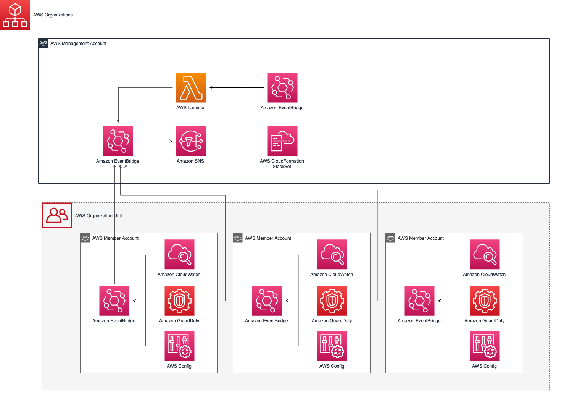
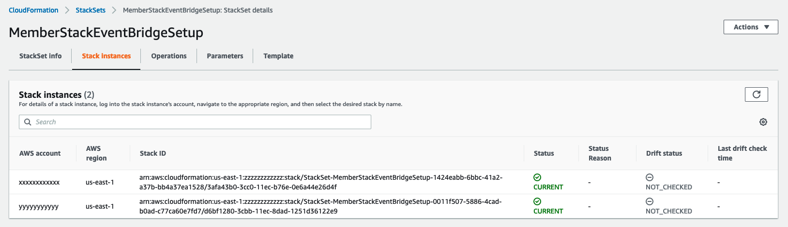

# Using Amazon EventBridge to receive events from Multiple Accounts managed by AWS organizations Service

[AWS Organizations](https://aws.amazon.com/organizations/) enables large projects which consist of multiple AWS accounts to establish a centrally managed environment that governs the infrastructure while meeting budgetary, security and audit requirements.

[Amazon Eventbridge](https://aws.amazon.com/eventbridge/) is a serverless event-driven service that delivers a stream of real-
time data from customized applications, AWS Services or Software as Service
(SaaS) application and routes that data to targets,  which in this use case is [an Amazon SNS
Topic](https://docs.aws.amazon.com/sns/latest/dg/sns-create-topic.html).

This project shows how to manage multiple accounts by AWS Organizations and efficiently gather all the events coming from different member accounts to the management/root account. This CDK project will be deployed in the management account, which will then use [AWS CloudFormation StackSets](https://docs.aws.amazon.com/AWSCloudFormation/latest/UserGuide/stacksets-concepts.html) to deploy the members' infrastructure in the member's accounts.

## Solution Overview

The architecture represents a solution to propagate events through multiple AWS member
accounts to the management/root AWS account by using [AWS Organizations](https://aws.amazon.com/organizations/), [Amazon Eventbridge](https://aws.amazon.com/eventbridge/), [AWS IAM Roles](https://docs.aws.amazon.com/IAM/latest/UserGuide/id_roles.html), and an [Amazon SNS topic](https://docs.aws.amazon.com/sns/latest/dg/sns-create-topic.html). The management account infrastructure stack deploys a SNS Topic configured to send email notifications when new topics are published to it from three different services: Amazon CloudWatch, AWS Config and Amazon GuardDuty. These rules use the default EventBridge event bus, with a Resource-based policy which enables all AWS Accounts in the organization to put events, as shown as below.

```
{
  "Version": "2012-10-17",
  "Statement": [{
    "Sid": "AllowAllAccountsInOrganizationToPutEvents",
    "Effect": "Allow",
    "Principal": "*",
    "Action": "events:PutEvents",
    "Resource": "arn:aws:events:us-east-1:xxxxxxxxxxxx:event-bus/default",
    "Condition": {
      "StringEquals": {
        "aws:PrincipalOrgID": "o-xxxxxxxx"
      }
    }
  }]
}
```

In each member AWS Accounts, three Amazon EventBridge rules are created respectively, but configured with the management's account default event bus as a target. Therefore, all the events retrieved by these three services will be forwarded to the organization's management account, which will publish these messages to the SNS topic in the same account.



## Prerequisites
1.	At least one [AWS accounts](https://signin.aws.amazon.com/signin?redirect_uri=https%3A%2F%2Fportal.aws.amazon.com%2Fbilling%2Fsignup%2Fresume&client_id=signup) which represents the member's account. Alternative other member accounts can be added.
2.	An [AWS account](https://signin.aws.amazon.com/signin?redirect_uri=https%3A%2F%2Fportal.aws.amazon.com%2Fbilling%2Fsignup%2Fresume&client_id=signup)  which is the management account.
3.	An accessible email address.
4.	Install [AWS Command Line (CLI)](https://docs.aws.amazon.com/cli/latest/userguide/cli-chap-install.html).
5.	Install [AWS CDK](https://docs.aws.amazon.com/cdk/latest/guide/getting_started.html#getting_started_install).

## Setup

### Set up the environment with AWS organizations
 
1. Login into your management/root account, which you want to use to manage your
organization.
2. Select AWS organizations service. Choose "Create Organization." Once you
create your organization you will receive verification at the email associated
with your root account.
3. As soon as the verification is completed, you will be able to add the other
customers account into the organization.
4. An invitation will be sent to each of the accounts added under the root
account.
5. In order to be able to have these accounts centrally managed by the root account
you have to log in to each of the accounts and go under invitations.
6. You should be able to see the invitation from the root account and accept it.
7. Create an [Organization Unit (OU)](https://docs.aws.amazon.com/organizations/latest/userguide/orgs_manage_ous.html) and place all the members accounts which should propagate the events  to the management account in this OU. the OU Id will be used later to deploy the StackSet.
8. Finally, enable [trusted access](https://docs.aws.amazon.com/AWSCloudFormation/latest/UserGuide/stacksets-orgs-enable-trusted-access.html?icmpid=docs_cfn_console) in the organization to be able to create StackSets and deploy resources from the management account to the member accounts.

### Deploy the solution

Bootstrap the management account: 

```
npx cdk bootstrap  \ 
    --profile <MANAGEMENT ACCOUNT AWS PROFILE>  \ 
    --cloudformation-execution-policies arn:aws:iam::aws:policy/AdministratorAccess  \
    aws://<MANAGEMENT ACCOUNT ID>/<REGION>
```

To deploy the stacks, use the `cdk-deploy-to.sh` script and pass a comma separated list of account IDs which represent the member accounts, the management account ID, region, AWS Organization ID and an accessible email sddress.

```
sh ./cdk-deploy-to.sh <MANAGEMENT ACCOUNT ID> <REGION> <AWS ORGANIZATION ID> <MEMBER ORGANIZATION UNIT ID> <EMAIL ADDRESS> AwsOrganizationsEventBridgeSetupManagementStack
```

Make sure to subscribe to the SNS Topic, when you receive an email after the Management stack is deployed.

After the deployment is completed, a StackSet will start deploying the infrastructure to the members' account. You can view this process in the AWS Console, under the CloudFormation service in the management account as shown in the picture below, or by logging in to the member account, under CloudFormation stacks.



## Testing the solution

This project will deploy an AWS CloudWatch Billing Alarm to the member account(s) to test that we're retrieving Email notifications. 
Using the member's account credentials, run the following AWS CLI Command to change the alarm status to "In Alarm": 

```
aws cloudwatch set-alarm-state --alarm-name 'BillingAlarm' --state-value ALARM --state-reason "testing only"
```


After this command is run, you will receive an Email with this Event: 


```
{
  "version": "0",
  "id": "e9d699ea-fdce-a44e-874c-2d6b9db7453f",
  "detail-type": "CloudWatch Alarm State Change",
  "source": "aws.cloudwatch",
  "account": "XXXXXXX",
  "time": "2021-10-14T14:49:54Z",
  "region": "us-east-1",
  "resources": [
    "arn:aws:cloudwatch:us-east-1:XXXXXXX:alarm:BillingAlarm"
  ],
  "detail": {
    "alarmName": "BillingAlarm",
    "state": {
      "value": "INSUFFICIENT_DATA",
      "reason": "Insufficient Data: 5 datapoints were unknown.",
      "reasonData": "{\"version\":\"1.0\",\"queryDate\":\"2021-10-14T14:49:54.786+0000\",\"statistic\":\"Maximum\",\"period\":300,\"recentDatapoints\":[],\"threshold\":10.0,\"evaluatedDatapoints\":[{\"timestamp\":\"2021-10-14T14:49:00.000+0000\"},{\"timestamp\":\"2021-10-14T14:44:00.000+0000\"},{\"timestamp\":\"2021-10-14T14:39:00.000+0000\"},{\"timestamp\":\"2021-10-14T14:34:00.000+0000\"},{\"timestamp\":\"2021-10-14T14:29:00.000+0000\"}]}",
      "timestamp": "2021-10-14T14:49:54.788+0000"
    },
    "previousState": {
      "value": "ALARM",
      "reason": "testing only",
      "timestamp": "2021-10-14T14:48:21.435+0000"
    },
    "configuration": {
      "metrics": [
        {
          "id": "40be3f90-7c18-c5ad-9a30-e2303f60cfe4",
          "metricStat": {
            "metric": {
              "namespace": "AWS/Billing",
              "name": "EstimatedCharges",
              "dimensions": {}
            },
            "period": 300,
            "stat": "Maximum"
          },
          "returnData": true
        }
      ]
    }
  }
}

```

## Clean up 

From your local machine, run the following command to clean all the resources created by this project:

```
npx cdk destroy
```
